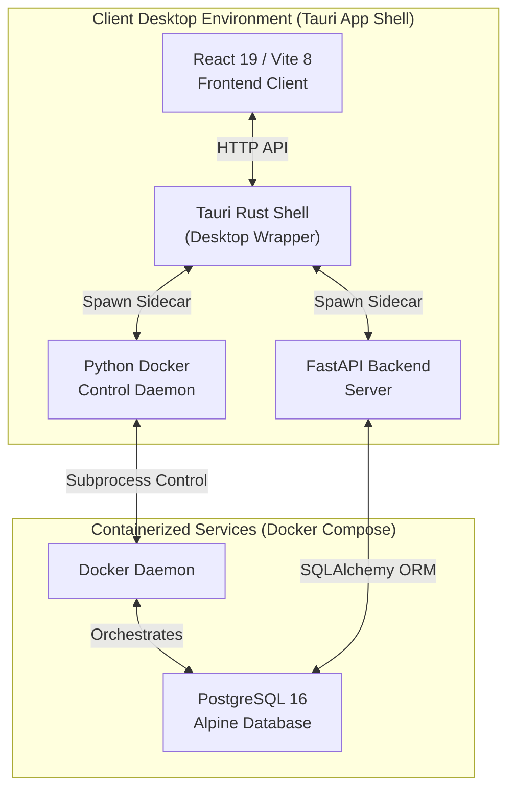

# Industrial Enterprise Resource Planning (ERP) Suite - Technical Portfolio

This repository hosts a containerized **Industrial Enterprise Resource Planning (ERP) Suite**, structured as a desktop-orchestrated, multi-profile application designed for industrial manufacturing and operations. 

Rather than a single utility, this suite integrates several core operational modules under a unified application shell:
1.  **Production Planning & Inventory Control (PPIC):** Oversees manufacturing job flows, daily plan targets, scheduling commitment logic, and Bill of Materials (BOM) matching.
2.  **Warehouse Management System (WMS):** Controls real-time stock levels, inventory bin transactions, material reservations for active jobs, and transaction history auditing.
3.  **Supply Chain Management (SCM):** Coordinates material procurement entries, inward/outward supply workflows, logistics tracking, and Material Requirements Planning (MRP) calculations.
4.  **Employee & User Access Management:** Manages Role-Based Access Control (RBAC), user session tracking, secure credential hashing, and authorized client network allowlists.

This document details the software's underlying technical architecture, focusing on the containerization layer, database engine lifecycle, and the Node.js/Vite/Tauri frontend infrastructure.

---

## 1. Architectural Topology



---

## 2. Docker Containerization & Orchestration Engine

The industrial ERP suite employs a localized container management pattern designed to decouple user interactions from low-level container management.

### Docker Compose Configuration
The storage engine is orchestrated via a multi-profile `docker-compose.yml` file located in the project root. This ensures that client machines can run without locally installing database engines, relying instead on containerized instances.

```yaml
services:
  db:
    image: postgres:16-alpine
    container_name: pims_db
    restart: unless-stopped
    environment:
      POSTGRES_DB: pims_db
      POSTGRES_USER: pims_user
      POSTGRES_PASSWORD: pims_password
    volumes:
      - pims_db_data:/var/lib/postgresql/data
    ports:
      - "5432:5432"
    healthcheck:
      test: ["CMD-SHELL", "pg_isready -U pims_user -d pims_db"]
      interval: 5s
      timeout: 3s
      retries: 10
    profiles: ["server", "single"]

volumes:
  pims_db_data:
```

### Python-Based Docker Control Daemon (`docker_control.py`)
To interface with the Docker daemon from the Tauri desktop wrapper, a lightweight HTTP control server runs locally on the host machine. 

*   **Daemon Health Gating:** Prior to executing container setups, the control script queries the Docker socket using the `docker info` command via subprocess calls.
*   **Subprocess Execution Engine:** Runs `docker compose -p pims --profile <profile> up --build -d` asynchronously by spawning threads to avoid blocking HTTP transaction cycles.
*   **Log Streaming & Status Gating:** Implements thread-safe job log buffering (`threading.Lock`) that reads from standard output pipes (`subprocess.PIPE`), exposing status endpoints (`/status?job_id=...`) polled by the client interface.

---

## 3. PostgreSQL Database Infrastructure

The data persistence layer relies on PostgreSQL 16 deployed inside an Alpine Linux container to minimize filesystem overhead.

### Connection Lifecycle & ORM Layer
*   **SQLAlchemy Engine:** The application initializes database connections using SQLAlchemy's async-compatible dialect.
*   **Table Schema Management:** The schema utilizes SQLAlchemy's Declarative Mapping. Tables are dynamically generated at startup via:
    ```python
    Base.metadata.create_all(bind=engine)
    ```
    This process is gated by profile checks (e.g., database connection attempts are bypassed on nodes running in `client` mode, where database access goes through HTTP routers rather than direct JDBC/socket connections).

### Security & IP Access Control List (ACL) Middleware
In `server` deployment mode, the FastAPI backend restricts entry points using custom host filter middleware:
*   Exempts basic discovery and diagnostic endpoints (`/api/health`, `/api/config`, `/api/setup`, `/api/discover`).
*   Validates the incoming client socket IP against the `AllowedClient` database registry.
*   Blocks unauthorized nodes with `HTTP 403 Forbidden` responses.

---

## 4. Node.js, Vite & Tauri Desktop Architecture

The client application is built on a modern frontend stack packaged into a native OS window container.

### Node.js & Vite Build System
*   **Dependency Engine:** Leverages React 19 (for virtual DOM rendering) and Vite 8 (for lightning-fast Hot Module Replacement and bundle splitting).
*   **Bundling Pipeline:** Vite compiles the JSX frontend assets into static bundles inside the `front-end/dist/` directory during execution of `npm run build`.
*   **Routing Layout:** Implements declarative client-side routing via `react-router-dom` v7. The system dynamically adjusts navigation components (Sidebar/Topbar) based on the user's role tokens parsed from localized state storage.

### Tauri Desktop Wrapper (`src-tauri`)
*   **Rust Shell Core:** Tauri provides a Rust-based system container that wraps the Vite-built static application assets into a native webview component.
*   **External Binaries (Sidecars):** Tauri compiles the Python backend and the Docker controller into standalone executable sidecars using PyInstaller. These are bundled into the binary packaging structure via the `externalBin` configuration key in `tauri.conf.json`:
    ```json
    "bundle": {
      "externalBin": [
        "backend/production-backend",
        "backend/docker_control"
      ],
      "resources": [
        "../../docker-compose.yml"
      ]
    }
    ```
*   **Path Resolution & Bundling:** Sidecar applications access host resources (like the root `docker-compose.yml`) using Tauri's sandboxed path APIs, dynamically resolving directory anchors at runtime.
